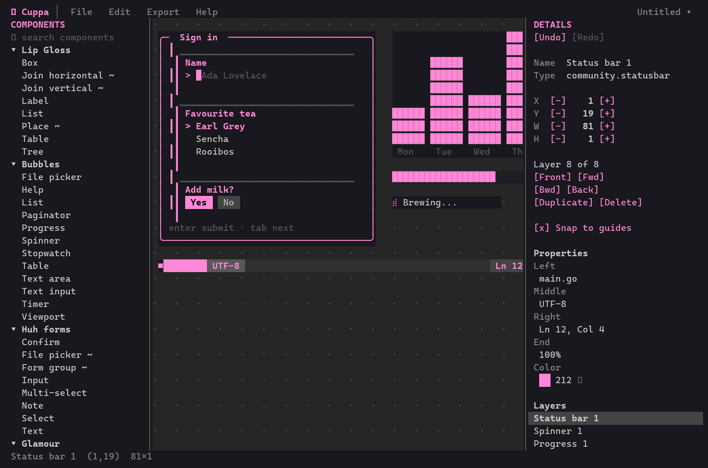

# ☕ Cuppa

**A visual designer for terminal UIs, made with Bubble Tea.**
Drag components onto a canvas, tune them, save the design, export a picture.
Think Lucidchart or Figma, but for [Bubble Tea](https://github.com/charmbracelet/bubbletea) interfaces, and it runs in your terminal.



## What you can do

- **Pick from 53 components** in the left bar: [Lip Gloss](https://github.com/charmbracelet/lipgloss) blocks, all the [Bubbles](https://github.com/charmbracelet/bubbles), [Huh](https://github.com/charmbracelet/huh) form fields, [Glamour](https://github.com/charmbracelet/glamour) markdown, [ntcharts](https://github.com/NimbleMarkets/ntcharts) charts and a set of community components.
- **Design with the mouse**: drag from the palette onto the canvas, click to select, shift-click or drag a box to select several, drag to move, drag the corners to resize. Alignment guides snap as you go.
- **Tune the details** in the right bar: position, size, layer order, and every property of the component (titles, colours, borders, options…).
- **Undo and redo** everything.
- **Save and open** `.cuppa` files ([format](docs/spec/cuppa-format.md)).
- **Export** to PNG, SVG or WebP through [Freeze](https://github.com/charmbracelet/freeze), or to colour or plain text.

Cuppa is early: the previews are faithful sketches of each component, not live widgets, and keyboard navigation is still to come (see the [roadmap](#roadmap)).

## Install

Download the zip for your system from the [latest release](https://github.com/fancy-cuppa/cuppa/releases/latest) (Windows, macOS and Linux, Intel/AMD and ARM), unzip it and run `cuppa-tui`:

```sh
cuppa-tui                # start with an empty design
cuppa-tui login.cuppa    # open a design
cuppa-tui --version
```

Use a terminal with mouse support (Windows Terminal, iTerm2, kitty, WezTerm, GNOME Terminal…) that is at least about 100 columns wide.

### Picture export needs Freeze

PNG, SVG and WebP export use Freeze, which is a separate install. Cuppa tells you on first launch if it is missing, and greys out those menu items until it is found:

```sh
go install github.com/charmbracelet/freeze@latest
# or: brew install charmbracelet/tap/freeze
# or download it from https://github.com/charmbracelet/freeze/releases
```

Colour and plain-text export work without it.

## Documentation

| | |
|---|---|
| [User guide](docs/user-guide.md) | Every mouse gesture, menu and shortcut |
| [Concept and architecture](docs/architecture.md) | Why it is built as a headless engine with thin front ends |
| [Contributing](docs/contributing.md) | Setup, conventions, adding a component to the catalog |
| [`.cuppa` format](docs/spec/cuppa-format.md) | The file format |
| [Decisions](docs/adr) | Architecture decision records |
| [Community components](docs/catalog/community-components.md) | Research behind the unofficial components |

## Roadmap

Tracked in [GitHub issues](https://github.com/fancy-cuppa/cuppa/issues): keyboard-first editing, exporting a design as Go source, live component previews, light/dark themes, and more front ends (desktop with Wails, a web app, an npm package) on the same engine.

## License

See [LICENSE](LICENSE).
